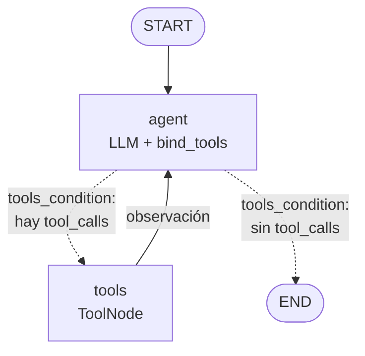

# Agente ReAct cíclico con memoria persistente

Pre-entrega 5 — AI Engineering (Coderhouse).

Agente construido con **LangGraph** que decide por sí mismo cuándo llamar herramientas,
reintenta o pide aclaraciones ante errores, y recuerda la conversación por `thread_id`
gracias a un checkpointer **SQLite** (`AsyncSqliteSaver`). Todo el código es asíncrono
(`asyncio`) y con type hints (verificado con `mypy --strict`).

## Arquitectura



El estado de cada paso se guarda con el checkpointer `AsyncSqliteSaver` en `checkpoints.db`,
indexado por `thread_id`. La estructura del diagrama es la que devuelve
`build_graph(...).get_graph().draw_mermaid()`: las flechas punteadas son la arista condicional.

| Archivo | Contenido |
|---|---|
| `src/agente/tools.py` | 3 herramientas `@tool` (con `args_schema` Pydantic y timeout) sobre una base de clientes/pedidos simulada |
| `src/agente/graph.py` | `AgentState(MessagesState)`, nodos, arista condicional, recorte de contexto, cierre de turnos cortados |
| `src/agente/main.py` | Demo que genera la traza, chat interactivo, `recursion_limit` |
| `tests/test_grafo.py` | Tests offline con un LLM falso (no consumen API), agrupados por criterio |
| `traces/` | Traza ReAct de ejemplo (`.json` y `.log`) |

### Herramientas

| Tool | Qué hace |
|---|---|
| `buscar_cliente(nombre)` | Busca clientes por nombre (sin tildes ni mayúsculas). Devuelve varios si es ambiguo |
| `buscar_pedidos(cliente_id)` | Cantidad, total y lista de pedidos. Devuelve `{"error": ...}` si el id no existe |
| `detalle_pedido(pedido_id)` | Ítems de un pedido puntual |

Cada tool declara un `args_schema` de **Pydantic** (`extra="forbid"`, límites con `Field(ge=..., min_length=...)`).
Si el LLM manda argumentos inválidos (por ejemplo `cliente_id=-5`), la tool **no se ejecuta**:
`handle_validation_error` devuelve `{"error": "Argumentos inválidos (...)"}` como observación y el agente corrige y reintenta.

Cada consulta a la "base" corre dentro de `asyncio.wait_for` con un **timeout** (`TIMEOUT_DB_S = 2.0`):
si no responde a tiempo, la tool devuelve `{"error": "... no respondió ..."}` en vez de colgar el grafo.

Los docstrings dicen cuándo usar cada tool y también **cuándo NO usarla** (por ejemplo, no llamar a
`buscar_cliente` si el `cliente_id` ya está en la conversación), para que el LLM elija mejor.

Como el usuario suele nombrar al cliente y no su id, responder "¿cuántos pedidos tuvo Ana Gómez?"
exige **dos llamadas encadenadas**: `buscar_cliente` → `buscar_pedidos`.

## Cómo cumple los criterios

| Criterio | Implementación |
|---|---|
| Autonomía | El LLM elige la tool vía `bind_tools()`; el ruteo lo hace `tools_condition`, sin if/else manuales |
| Ciclo de retorno | Las tools devuelven `{"error": ...}` con una pista; los argumentos se validan con Pydantic y los inválidos vuelven como error; los timeouts también vuelven como error; `ToolNode(handle_tool_errors=True)` convierte excepciones en mensajes; el system prompt indica reintentar o pedir aclaración |
| Resiliencia de estado | `AsyncSqliteSaver` + `thread_id`. La demo reabre la base en una conexión nueva y retoma el thread |
| Límite de recursión | `recursion_limit=10` en cada invocación; `GraphRecursionError` se captura, queda en la traza y `cerrar_turno_cortado` deja el thread consistente (completa `tool_calls` pendientes y agrega una respuesta final) para que el próximo turno funcione |
| Estado sucio | `trim_messages` envía al LLM solo los últimos 20 mensajes (el historial completo queda en el checkpoint) |
| Código limpio | Python 3.12+, type hints, `async`/`await` en tools, nodos, checkpointer y streaming |

## Seguridad: mínimo privilegio

El LLM no ejecuta nada: solo propone `tool_calls`, y el código decide qué se corre.

- Las tools son de **solo lectura**: no hay ninguna que modifique, borre o cree datos.
- Consultan por **parámetros validados** (ids enteros con rango, nombres con largo acotado);
  nunca ejecutan SQL, comandos ni código generado por el LLM.
- Las API keys se leen de variables de entorno y no forman parte del estado ni de las trazas.

## Límites del agente

Las tools solo consultan **por cliente** (buscarlo, ver sus pedidos y el detalle de un pedido).
Ante una pregunta que ninguna tool puede responder, el agente no inventa datos ni fuerza una tool:
explica qué le falta y ofrece lo que sí puede hacer. Ejemplo real del chat:

```
Vos: cual es el producto más vendido?

Agente: No puedo responderte eso con las herramientas que tengo. Solo me dejan consultar por
cliente (sus pedidos y el detalle de cada pedido). No tengo un ranking general de ventas por
producto ni una forma de listar todos los pedidos.

Lo que sí puedo hacer:
- Ver qué productos compró un cliente puntual. Para eso necesito su nombre o número de cliente.
- Armar el ranking de productos de uno o varios clientes que me indiques. Reviso sus pedidos y
  sumo las cantidades.

¿Querés que lo haga con algún cliente en particular? ...
```

No llamó a ninguna tool: las docstrings (incluido el "cuándo NO usarla") le alcanzaron para darse
cuenta de que ninguna servía. Para soportar esa pregunta habría que agregar una tool de ranking.

## Cómo levantar el entorno

Requiere Python 3.12 o superior.

### Linux / macOS

```bash
git clone https://github.com/pantonini2011/ai-engineering-5.git
cd ai-engineering-5

python3.12 -m venv .venv
source .venv/bin/activate
pip install -r requirements.txt    # versiones exactas probadas
# alternativa con rangos de versión: pip install -e ".[dev]"

cp .env.example .env               # y completá ANTHROPIC_API_KEY u OPENAI_API_KEY
```

### Windows (PowerShell)

```powershell
git clone https://github.com/pantonini2011/ai-engineering-5.git
cd ai-engineering-5

py -3.12 -m venv .venv
.\.venv\Scripts\Activate.ps1
pip install -r requirements.txt

copy .env.example .env             # y completá ANTHROPIC_API_KEY u OPENAI_API_KEY
```

Si `Activate.ps1` falla con *"la ejecución de scripts está deshabilitada en este sistema"*,
habilitá los scripts para tu usuario (una sola vez) y volvé a activar:

```powershell
Set-ExecutionPolicy -Scope CurrentUser RemoteSigned
```

En `cmd` se activa con `.venv\Scripts\activate.bat`, sin cambiar nada.

### Elegir el proveedor de LLM

En el `.env`, `LLM_PROVIDER=anthropic` u `LLM_PROVIDER=openai` (y opcionalmente `LLM_MODEL`).
Para cambiarlo solo en la terminal actual, sin tocar el `.env`:

```bash
export LLM_PROVIDER=openai          # Linux / macOS
$env:LLM_PROVIDER = "openai"        # Windows PowerShell
set LLM_PROVIDER=openai             # Windows cmd
```

Las claves se leen de variables de entorno (`.env` está en `.gitignore`, nunca se sube).
El `.env` va en la raíz del repo, junto a `pyproject.toml`.

## Cómo ejecutarlo

Con el venv activado (los comandos son iguales en Linux, macOS y Windows):

```bash
# Demo guionada: genera traces/traza_ejecucion.json y traces/traza_ejecucion.log
python -m agente.main

# Chat interactivo con memoria (probá cortar y volver a entrar con el mismo thread-id)
python -m agente.main --chat --thread-id mi-sesion

# Tests offline (no usan API key)
pytest
mypy src tests
```

En el chat, cada turno muestra los pasos del ciclo ReAct (qué tool decide usar el agente y qué
devuelve) y después la respuesta:

```
Vos: ¿cuántos pedidos tiene Juan Pérez?
  → El agente decide usar: buscar_cliente({'nombre': 'Juan Pérez'})
  → buscar_cliente devuelve: {'resultados': [{'cliente_id': 101, 'nombre': 'Juan Pérez', 'ciudad': 'Rosario'}]}
  → El agente decide usar: buscar_pedidos({'cliente_id': 101})
  → buscar_pedidos devuelve: {'cliente_id': 101, 'pedidos': 1, 'total': 3200.0, ...}

Agente: Juan Pérez, de Rosario, tiene 1 pedido. Es el n.º 5001 del 02/08/2026, por $3.200, y figura como entregado.
```

## Tests

Los tests usan un LLM falso con respuestas guionadas, así que no gastan API. El grafo, las tools
y el checkpointer SQLite son los reales. Están agrupados por criterio de aceptación,
y `pytest` muestra cada uno por nombre:

| Criterio | Tests (`tests/test_grafo.py`) |
|---|---|
| Autonomía y multi-paso | `TestAutonomiaYMultipaso`: encadena `buscar_cliente` → `buscar_pedidos`; termina solo cuando el LLM no pide tools |
| Ciclo de retorno | `TestCicloDeRetorno`: el error de una tool vuelve al agente; argumentos inválidos (Pydantic) no ejecutan la tool; timeout de la base vuelve como error |
| Resiliencia de estado | `TestResilienciaDeEstado`: recuerda el thread al reabrir la base; threads distintos no comparten memoria |
| Límite de recursión | `TestLimiteDeRecursion`: `recursion_limit` corta bucles; el turno cortado deja el thread consistente (límite par e impar) |

```
tests/test_grafo.py::TestAutonomiaYMultipaso::test_encadena_dos_tools_para_responder PASSED
tests/test_grafo.py::TestAutonomiaYMultipaso::test_termina_cuando_el_llm_no_pide_tools PASSED
tests/test_grafo.py::TestCicloDeRetorno::test_error_de_tool_vuelve_al_agente PASSED
tests/test_grafo.py::TestCicloDeRetorno::test_argumentos_invalidos_no_ejecutan_la_tool PASSED
tests/test_grafo.py::TestCicloDeRetorno::test_timeout_de_la_base_vuelve_como_error PASSED
tests/test_grafo.py::TestResilienciaDeEstado::test_recuerda_el_thread_al_reabrir_la_base PASSED
tests/test_grafo.py::TestResilienciaDeEstado::test_threads_distintos_no_comparten_memoria PASSED
tests/test_grafo.py::TestLimiteDeRecursion::test_recursion_limit_corta_bucles PASSED
tests/test_grafo.py::TestLimiteDeRecursion::test_turno_cortado_deja_el_thread_consistente[limite_par] PASSED
tests/test_grafo.py::TestLimiteDeRecursion::test_turno_cortado_deja_el_thread_consistente[limite_impar] PASSED
========================= 10 passed =========================
```

Para correr un solo grupo: `pytest -k TestCicloDeRetorno`.

La demo ejecuta estos turnos:

1. `sesion-ana`: "¿Cuántos pedidos tuvo Ana Gómez y cuál fue el total?" → `buscar_cliente` + `buscar_pedidos` (multi-paso).
2. `sesion-ana`: "¿Y el último? ¿Qué productos tenía?" → usa la memoria para saber que el último es el 5047 y llama a `detalle_pedido`.
3. `sesion-errores`: "Pasame el total de pedidos del cliente 999, es Juan Pérez." → `buscar_pedidos(999)` devuelve error;
   el agente busca por nombre, encuentra el id 101 y reintenta (ciclo de retorno).
4. `sesion-errores`: "¿Y cuántos pedidos tiene Ana?" → hay dos "Ana"; el agente pregunta a cuál se refiere.
5. `sesion-ana`, **con una conexión nueva al `.db`**: "Recordame: ¿de qué cliente veníamos hablando?" → responde desde el checkpoint, sin tools.

Cada corrida de la demo borra antes sus propios threads, así que siempre arranca de cero. Si la corrida
falla (API key inválida, sin red, etc.), muestra un mensaje corto y **no pisa la traza anterior**.

## Traza de ejemplo

La traza incluida en el repo se generó con la configuración por defecto (`LLM_PROVIDER=anthropic`,
modelo `claude-sonnet-5-5`, `recursion_limit=10`); el proveedor y el modelo quedan registrados al
principio del `.log` y en el `.json`. Fragmento del turno 3, el ciclo de retorno:

```
[sesion-errores] Usuario: Pasame el total de pedidos del cliente 999, es Juan Pérez.
  → El agente decide usar: buscar_pedidos({'cliente_id': 999})
  → El agente decide usar: buscar_cliente({'nombre': 'Juan Pérez'})
  → buscar_pedidos devuelve: {'error': 'No existe el cliente 999. Verificá el id con buscar_cliente.'}
  → buscar_cliente devuelve: {'resultados': [{'cliente_id': 101, 'nombre': 'Juan Pérez', 'ciudad': 'Rosario'}]}
  → El agente decide usar: buscar_pedidos({'cliente_id': 101})
  → buscar_pedidos devuelve: {'cliente_id': 101, 'pedidos': 1, 'total': 3200.0, ...}
  → Respuesta: El cliente 999 no existe. Encontré un único Juan Pérez, que es el cliente 101 de Rosario, ...
```

En el primer paso el modelo pidió las dos tools en paralelo (una sola respuesta con dos `tool_calls`);
con el error de la primera, reintentó `buscar_pedidos` con el id correcto.

Traza completa: [`traces/traza_ejecucion.log`](traces/traza_ejecucion.log) (legible) y
[`traces/traza_ejecucion.json`](traces/traza_ejecucion.json) (estructurada, paso a paso).
