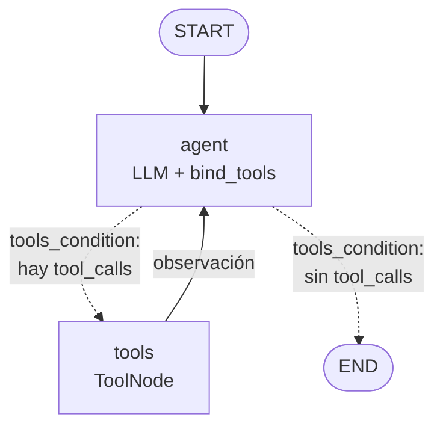

# Agente ReAct cíclico con memoria persistente

Pre-entrega 5 — AI Engineering (Coderhouse).

Agente construido con **LangGraph** que decide por sí mismo cuándo llamar herramientas,
reintenta o pide aclaraciones ante errores, y recuerda la conversación por `thread_id`
gracias a un checkpointer **SQLite** (`AsyncSqliteSaver`). Todo el código es asíncrono
(`asyncio`) y con type hints (verificado con `mypy --strict`).

## Arquitectura



El estado de cada paso se guarda con el checkpointer `AsyncSqliteSaver` en `checkpoints.db`,
indexado por `thread_id`. La estructura del diagrama es la que devuelve
`build_graph(...).get_graph().draw_mermaid()`: las flechas punteadas son la arista condicional.

| Archivo | Contenido |
|---|---|
| `src/agente/tools.py` | 3 herramientas `@tool` (con `args_schema` Pydantic y timeout) sobre una base de clientes/pedidos simulada |
| `src/agente/graph.py` | `AgentState(MessagesState)`, nodos, arista condicional, recorte de contexto, cierre de turnos cortados |
| `src/agente/main.py` | Demo que genera la traza, chat interactivo, `recursion_limit` |
| `tests/test_grafo.py` | Tests offline con un LLM falso (no consumen API) |
| `traces/` | Traza ReAct de ejemplo (`.json` y `.log`) |

### Herramientas

| Tool | Qué hace |
|---|---|
| `buscar_cliente(nombre)` | Busca clientes por nombre (sin tildes ni mayúsculas). Devuelve varios si es ambiguo |
| `buscar_pedidos(cliente_id)` | Cantidad, total y lista de pedidos. Devuelve `{"error": ...}` si el id no existe |
| `detalle_pedido(pedido_id)` | Ítems de un pedido puntual |

Cada tool declara un `args_schema` de **Pydantic** (`extra="forbid"`, límites con `Field(ge=..., min_length=...)`).
Si el LLM manda argumentos inválidos (por ejemplo `cliente_id=-5`), la tool **no se ejecuta**:
`handle_validation_error` devuelve `{"error": "Argumentos inválidos (...)"}` como observación y el agente corrige y reintenta.

Cada consulta a la "base" corre dentro de `asyncio.wait_for` con un **timeout** (`TIMEOUT_DB_S = 2.0`):
si no responde a tiempo, la tool devuelve `{"error": "... no respondió ..."}` en vez de colgar el grafo.

Los docstrings dicen cuándo usar cada tool y también **cuándo NO usarla** (por ejemplo, no llamar a
`buscar_cliente` si el `cliente_id` ya está en la conversación), para que el LLM elija mejor.

Como el usuario suele nombrar al cliente y no su id, responder "¿cuántos pedidos tuvo Ana Gómez?"
exige **dos llamadas encadenadas**: `buscar_cliente` → `buscar_pedidos`.

## Cómo cumple los criterios

| Criterio | Implementación |
|---|---|
| Autonomía | El LLM elige la tool vía `bind_tools()`; el ruteo lo hace `tools_condition`, sin if/else manuales |
| Ciclo de retorno | Las tools devuelven `{"error": ...}` con una pista; los argumentos se validan con Pydantic y los inválidos vuelven como error; los timeouts también vuelven como error; `ToolNode(handle_tool_errors=True)` convierte excepciones en mensajes; el system prompt indica reintentar o pedir aclaración |
| Resiliencia de estado | `AsyncSqliteSaver` + `thread_id`. La demo reabre la base en una conexión nueva y retoma el thread |
| Límite de recursión | `recursion_limit=10` en cada invocación; `GraphRecursionError` se captura, queda en la traza y `cerrar_turno_cortado` deja el thread consistente (completa `tool_calls` pendientes y agrega una respuesta final) para que el próximo turno funcione |
| Estado sucio | `trim_messages` envía al LLM solo los últimos 20 mensajes (el historial completo queda en el checkpoint) |
| Código limpio | Python 3.12+, type hints, `async`/`await` en tools, nodos, checkpointer y streaming |

## Seguridad: mínimo privilegio

El LLM no ejecuta nada: solo propone `tool_calls`, y el código decide qué se corre.

- Las tools son de **solo lectura**: no hay ninguna que modifique, borre o cree datos.
- Consultan por **parámetros validados** (ids enteros con rango, nombres con largo acotado);
  nunca ejecutan SQL, comandos ni código generado por el LLM.
- Las API keys se leen de variables de entorno y no forman parte del estado ni de las trazas.

## Cómo levantar el entorno

Requiere Python 3.12 o superior.

### Linux / macOS

```bash
git clone https://github.com/pantonini2011/ai-engineering-5.git
cd ai-engineering-5/agente-react

python3.12 -m venv .venv
source .venv/bin/activate
pip install -r requirements.txt    # versiones exactas probadas
# alternativa con rangos de versión: pip install -e ".[dev]"

cp .env.example .env               # y completá ANTHROPIC_API_KEY u OPENAI_API_KEY
```

### Windows (PowerShell)

```powershell
git clone https://github.com/pantonini2011/ai-engineering-5.git
cd ai-engineering-5\agente-react

py -3.12 -m venv .venv
.\.venv\Scripts\Activate.ps1
pip install -r requirements.txt

copy .env.example .env             # y completá ANTHROPIC_API_KEY u OPENAI_API_KEY
```

Si `Activate.ps1` falla con *"la ejecución de scripts está deshabilitada en este sistema"*,
habilitá los scripts para tu usuario (una sola vez) y volvé a activar:

```powershell
Set-ExecutionPolicy -Scope CurrentUser RemoteSigned
```

En `cmd` se activa con `.venv\Scripts\activate.bat`, sin cambiar nada.

### Elegir el proveedor de LLM

En el `.env`, `LLM_PROVIDER=anthropic` u `LLM_PROVIDER=openai` (y opcionalmente `LLM_MODEL`).
Para cambiarlo solo en la terminal actual, sin tocar el `.env`:

```bash
export LLM_PROVIDER=openai          # Linux / macOS
$env:LLM_PROVIDER = "openai"        # Windows PowerShell
set LLM_PROVIDER=openai             # Windows cmd
```

Las claves se leen de variables de entorno (`.env` está en `.gitignore`, nunca se sube).
Se usa el primer `.env` que se encuentre subiendo desde `src/agente/`, así que el de
`agente-react/` tiene prioridad sobre uno en una carpeta superior.

## Cómo ejecutarlo

Con el venv activado (los comandos son iguales en Linux, macOS y Windows):

```bash
# Demo guionada: genera traces/traza_ejecucion.json y traces/traza_ejecucion.log
python -m agente.main

# Chat interactivo con memoria (probá cortar y volver a entrar con el mismo thread-id)
python -m agente.main --chat --thread-id mi-sesion

# Tests offline (no usan API key)
pytest
mypy src
```

La demo ejecuta estos turnos:

1. `sesion-ana`: "¿Cuántos pedidos tuvo Ana Gómez y cuál fue el total?" → `buscar_cliente` + `buscar_pedidos` (multi-paso).
2. `sesion-ana`: "¿Y el último? ¿Qué productos tenía?" → usa la memoria para saber que el último es el 5047 y llama a `detalle_pedido`.
3. `sesion-errores`: "Pasame el total de pedidos del cliente 999." → la tool devuelve error; el agente reintenta o pide aclaración.
4. `sesion-errores`: "¿Y cuántos pedidos tiene Ana?" → hay dos "Ana"; el agente debe preguntar a cuál se refiere.
5. `sesion-ana`, **con una conexión nueva al `.db`**: "¿De qué cliente veníamos hablando?" → responde desde el checkpoint, sin tools.

## Ejemplo de traza (formato)

```
[sesion-ana] Usuario: ¿Cuántos pedidos tuvo Ana Gómez y cuál fue el total?
  → El agente decide usar: buscar_cliente({'nombre': 'Ana Gómez'})
  → buscar_cliente devuelve: {'resultados': [{'cliente_id': 102, 'nombre': 'Ana Gómez', ...}]}
  → El agente decide usar: buscar_pedidos({'cliente_id': 102})
  → buscar_pedidos devuelve: {'cliente_id': 102, 'pedidos': 3, 'total': 14500.0, ...}
  → Respuesta: Ana Gómez tuvo 3 pedidos por un total de $14.500.
```

La traza completa con el LLM real (generada con OpenAI `gpt-4o-mini`, `LLM_PROVIDER=openai`) está en [`traces/traza_ejecucion.json`](traces/traza_ejecucion.json)
y [`traces/traza_ejecucion.log`](traces/traza_ejecucion.log).
